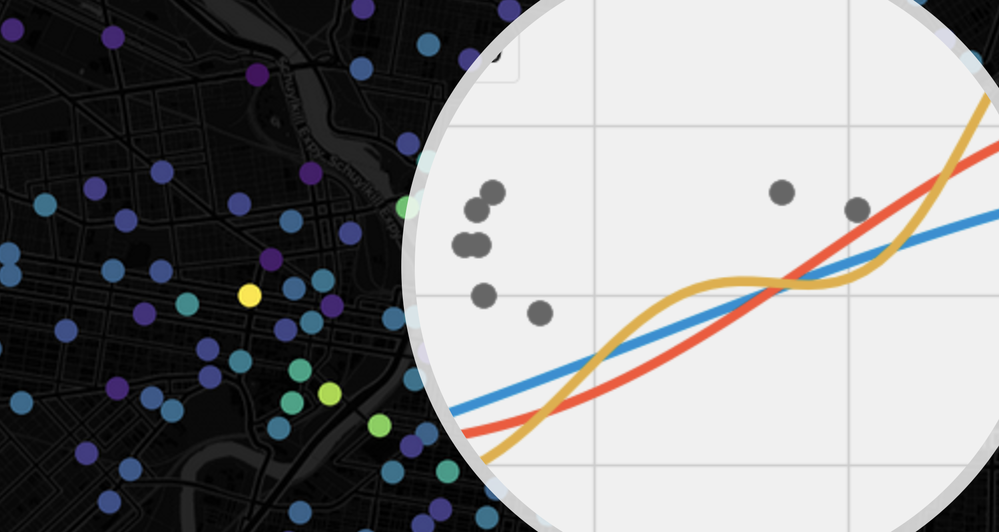

#  Predictive modeling & machine learning
- [**Predictive Modeling with scikit-learn**](https://github.com/musa-550-fall-2024/predictiveModeling/blob/main/predictiveModeling.ipynb)
- [**Exercise: predicting house prices**](https://github.com/musa-550-fall-2024/predictiveModeling/blob/main/exercise.ipynb)

## Reference

- scikit-learn
  - [User guide](https://scikit-learn.org/stable/user_guide.html)
  - [RandomForestRegressor](https://scikit-learn.org/stable/modules/generated/sklearn.ensemble.RandomForestRegressor.html)
  - [Column transformer example](https://scikit-learn.org/stable/auto_examples/compose/plot_column_transformer_mixed_types.html)
- [Decision trees](https://towardsdatascience.com/https-medium-com-lorrli-classification-and-regression-analysis-with-decision-trees-c43cdbc58054)
- Machine learning models in the real estate industry
  - [Airbnb recommends pricing to hosts](https://spectrum.ieee.org/computing/software/the-secret-of-airbnbs-pricing-algorithm)
  - [Trulia converts house photos to house features](https://www.trulia.com/blog/tech/image-recognition/)
  - [Zillow's Zestimate](https://www.zillow.com/research/zestimate-forecast-methodology/)
- [The missingno package](https://github.com/ResidentMario/missingno)
- [Presentation on the Office of Property Assessment's methodology](https://www.phila.gov/OPA/Documents/Property%20Assessment%20Methodology.pdf)
- [City Controller analysis of property assessments](https://controller.phila.gov/philadelphia-audits/property-assessment-review/)
- [Algorithmic fairness with case study on modeling Philadelphia's home values](https://urbanspatial.github.io/AlgorithmicFairness_ACodebasedPrimerForPublicSectorDataScientists)
